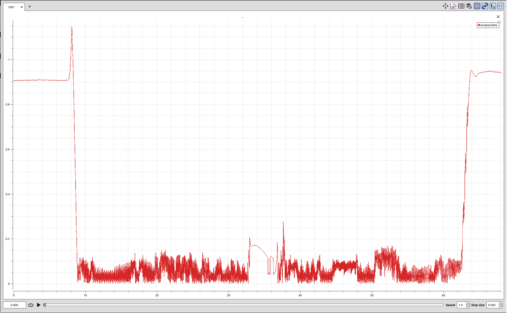

# Lateral error debugging records
## 1.Find the problem:

In the two images above, the first one is a lateral error record chart, and the second one is a comparison chart of the expected trajectory and the actual trajectory.By comparing the two images, some issues can be observed.

(1)The amplitude of the lateral error data does not correspond to the path.

(2)According to kinematic principles, the magnitude of the lateral error should gradually change and should not exhibit large jumps.

## 2.Inspect and modify the code.
### Mistake 1:

Incorrect code:
    
    lateral_error = dist_Projector_distance[current_target_index];

correct code:

    lateral_error = dist_Projector_distance[0];

This part of the code uses the wrong index to record the lateral error values. The modified code will now record the lateral error of the vehicle from the nearest projected point.
### Mistake 2:

Incorrect code:

    auto Inner_product = (((road_point[i + 1][0] - road_point[i][0]) * road_point[i][0]) +
                              ((road_point[i + 1][1] - road_point[i][1]) * road_point[i][1]));

correct code:

    auto Inner_product = (((road_point[i + 1][1] - road_point[i][1]) * road_point[i][0]) -
                              ((road_point[i + 1][0] - road_point[i][0]) * road_point[i][1]));

This part of the code confused the concepts of vector cross product and dot product, leading to incorrect lateral error results. The modified code resolves this issue. The value obtained by taking the cross product of two vectors is the area of the triangle formed by the two vectors. Dividing this area by the length of the base gives the desired lateral error value.
## 3.Run the experiment again to validate the code.

As shown in the figure, the new experimental results indicate that the lateral error magnitude gradually changes along the path, and there are no longer significant jumps. This conforms to kinematic principles, and the data amplitude corresponds to the tracking of the vehicle. It is considered that the problem has been fixed.
